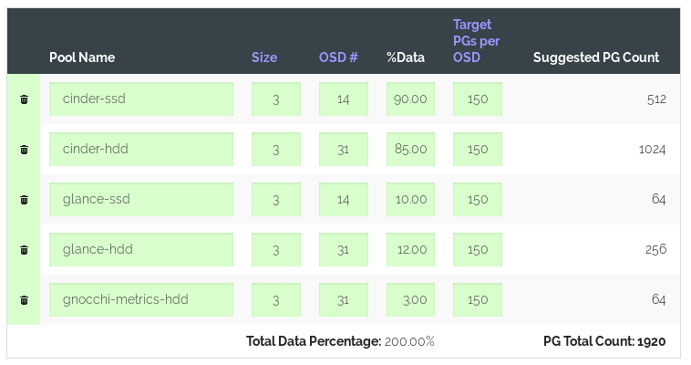
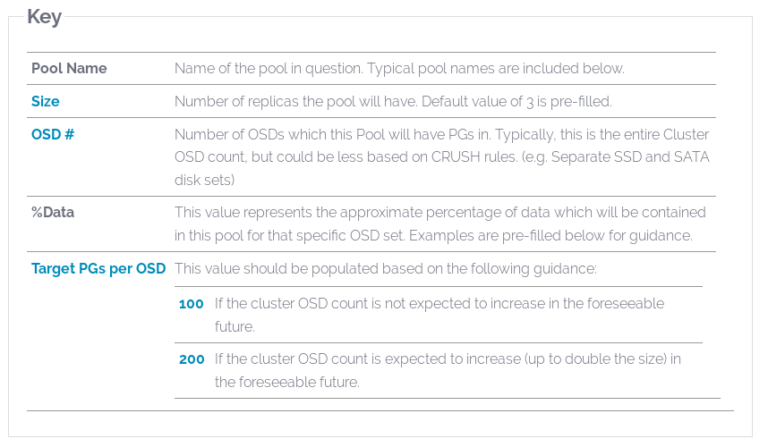

Ceph Deployment
===============

This process covers how to set up our Ceph cluster for use with OpenStack. At
the time that it was written, all `mgmt` and `stor` nodes were active. Only the
following `nova` nodes were active:

- `nova04`
- `nova05`
- `nova10`
- `nova11`
- `nova12`

Another guide will cover adding new nodes to the cluster, and this guide should
cover adding nodes to Ceph as well.

Steps
-----

### Setup

The Ceph cluster needs to have NTP configured first. Our Ansible repository
configures all nodes (`mgmt`, `nova`, and `stor`) with chronyd using a role
from Ansible Galaxy.

Next, the deployment node needs to be configured. We will be using `mgmt01` as
the deployment node in this guide, and it is recommended that you do the same.
This node needs to have SSH access to all nodes, ceph-deploy installed to
perform the deployment, and Vault so the ceph keyrings and configurations can
be backed up.

**All the following commands are performed on `mgmt01`, logged in as `ops`.**

First, check out the [SSH CA](./vault-ssh-ca.md#getting-access) guide for
information on getting a key that can access all the nodes. Once a signed key
has been retrieved, add the following snippet to `~/.ssh/config`:

```
Host mgmt*
        IdentityFile ~/.ssh/ritsec-ops
        IdentityFile ~/.ssh/ritsec-ops-signed.pub
        StrictHostKeyChecking no

Host stor*
        IdentityFile ~/.ssh/ritsec-ops
        IdentityFile ~/.ssh/ritsec-ops-signed.pub
        StrictHostKeyChecking no

Host nova*
        IdentityFile ~/.ssh/ritsec-ops
        IdentityFile ~/.ssh/ritsec-ops-signed.pub
        StrictHostKeyChecking no
```

Change the `IdentityFile` paths to point to your private key and signed public
key as necessary.

This snippet will allow you to connect to nodes in the cluster using their
hostnames. This relies on properly-configured DNS zones and the correct search
domain set up on each node. To test that this is set up properly, run a test
`dig` command.

```shell
$ dig +noall +answer +search mgmt01
mgmt01.ritsec.co.	7165	IN	A	10.0.10.201
```

If hostnames cannot be resolved, stop here and troubleshoot the issue. Do not
proceed until hostnames can be resolved. Ceph primarily accesses hosts in the
cluster by hostname, so you _really want this to work._

Once SSH is configured properly, install ceph-deploy.

```shell
sudo apt install -y python3-pip
pip3 install --user ceph-deploy
```

Note that the above commands are **not** the same as in the Ceph documentation.
The documentation recommends adding their repository and installing a debian
package containing ceph-deploy. At the time of writing, that package installed
ceph-deploy under python2, which will not work unless all nodes in the cluster
have python2 installed. Since python2 will be end of life soon, that's
unacceptable.

Finally, [install Vault](https://www.vaultproject.io/downloads.html). The Vault
client will be used at the end to back up all Ceph configurations and keyrings
so the cluster doesn't have to be redeployed if `mgmt01` fails.

The last step is to set up "inventory files". These aren't required, but will
make it easier to run the deployment commands later on.

```shell
mkdir ~/ritsec-ceph
cd ~/ritsec-ceph

cat > mgmt.txt << EOF
mgmt01.ritsec.co
mgmt02
mgmt03
EOF

cat > nova.txt << EOF
nova04
nova05
nova10
nova11
nova12
EOF

cat > stor.txt << EOF
stor01
stor02
stor03
EOF
```

While creating the "inventory files" is optional, the rest of this guide will
assume they have been created for the sake of brevity.

Note that `mgmt01`'s entire FQDN is used. This is because a host's hostname
will resolve to a loopback address, and our OpenStack nodes are not configured
to listen on loopback for SSH connections.

### Clean up Old Deployment

If a Ceph cluster has been deployed before, it will need to be removed before
installing the new cluster. Fortunately, this is quite simple with ceph-deploy.

```shell
# Remove all Ceph data and files
ceph-deploy purgedata $(cat mgmt.txt nova.txt stor.txt)

# Remove all Ceph packages
ceph-deploy purge $(cat mgmt.txt nova.txt stor.txt)
```

Unfortunately, `ceph-deploy purge` will not remove dependencies, so old and
conflicting versions of packages can be left installed on the systems. A dose
of `apt autoremove` with a side of `xargs` makes quick work of this.

```shell
cat mgmt.txt nova.txt stor.txt | xargs -I {} ssh {} sudo apt-get autoremove -y
```

If the disks you plan to use have already been configured for a prior Ceph
installation, you will need to remove the LVM configurations from them. The
following code snippet should be run on each of the `stor` nodes. However,
**please note** that the following commands _will not_ exclude any OS
partitions that were configured with LVM.

**IF ANY OS PARTITIONS USE LVM, THESE COMMANDS WILL CAUSE DATA LOSS!** Please
_triple-check_ before doing something you may regret!

```shell
# Remove all Logical Volumes
sudo lvdisplay | grep "LV Path" | awk '{print $NF}' | xargs sudo lvremove -f

# Remove all Volume Groups
sudo vgdisplay | grep "VG Name" | awk '{print $NF}' | xargs sudo vgremove -f

# Remove all Physical Volumes
sudo pvdisplay | grep "PV Name" | awk '{print $NF}' | xargs sudo pvremove -f

# Make sure all LVs, VGs, and PVs are gone (prints nothing if all are gone)
sudo lvdisplay && sudo vgdisplay && sudo pvdisplay
```

Lastly, any prior configurations and keys can be removed if you know where the
old ceph-deploy directory was. If you aren't sure where it may be, don't worry!
It's pretty much useless at this point, so there's really no harm in leaving it
around; I only suggest it to help keep things clean.

### Install the Ceph Cluster

If you haven't already done so, create a new directory for the Ceph deployment.
All ceph-deploy commands should be run in this directory.

_If you created the "inventory files", you should have already done this step._

```shell
mkdir ~/ritsec-ceph
cd ~/ritsec-ceph
```

Start the deployment by creating the cluster.

```shell
ceph-deploy new $(cat mgmt.txt)
```

This will generate a Ceph configuration file in `ceph.conf`, but we need to
change a few things.

```shell
cat > ceph.conf << EOF
[global]
fsid = $(uuidgen)
mon_initial_members = mgmt01, mgmt02, mgmt03
mon_host = 10.0.9.201, 10.0.9.202, 10.0.9.203
public network = 10.0.9.0/24
cluster network = 10.0.8.0/24
auth_cluster_required = cephx
auth_service_required = cephx
auth_client_required = cephx
EOF
```

This configuration will be good enough for now. Later we will make some
modifications and push out the new configuration file, which will demonstrate
how to change the Ceph configuration after the cluster has been deployed. For
now, let's continue.

With the initial configuration file all set and the cluster created, we can
proceed with installing and setting up the cluster.

```shell
# Install Ceph packages on the mgmt nodes
ceph-deploy install $(cat mgmt.txt)

# Deploy the initial monitors
ceph-deploy mon create-initial

# Deploy the admin keyring to the mgmt nodes
ceph-deploy admin $(cat mgmt.txt)

# Deploy manager daemons to the mgmt nodes
ceph-deploy mgr create $(cat mgmt.txt)

# Install Ceph packages on the stor nodes
ceph-deploy install $(cat stor.txt)
```

### Adding the OSDs

Now it's time to add some OSDs. Unfortunately, this step is a bit more involved
because it requires determining which disks on the storage nodes are _not_ used
for the operating system partition(s).

The following command can be used to get a list of all disks (in sdX) format
that are not ext4 formatted.

```shell
lsblk -no name | grep -v $(lsblk -no name,fstype | grep ext4 | awk '{print $1}' | sed 's/[^a-z]//g')
```

This example is only documented for the sake of completion, and may not work on
the environment you are deploying against. Please make sure to double-check
your results before continuing.

Once you have found all the disks that you will use as OSDs for Ceph, add them
to text files with their storage node's hostname. This will make the next step
easier.

For example, if the disks `/dev/sdb`, `/dev/sdc`, and `/dev/sdd` on `stor01`
will be used as OSDs, the following command will set up the file properly:

```shell
cat > stor01-disks.txt << EOF
sdb
sdc
sdd
EOF
```

Once these files have been written for all storage nodes in the `stor.txt`
file, this double for-loop can be used to clear the disks and add them as
bluestore OSDs.

```shell
for srv in $(cat stor.txt)
do
  for disk in $(cat ${srv}-disks.txt)
  do
    ceph-deploy disk zap ${srv} /dev/${disk}
    ceph-deploy osd create --bluestore --data /dev/${disk} ${srv}
  done
done
```

If you aren't adding that many OSDs, it may just be easier to run each of the
ceph-deploy commands yourself. After more than a few disks though it can be
annoying.

### Configuring the Pools

Several OSD pools must be configured for the various OpenStack services that
require shared storage. These pools will be separated based on disk type so
that I/O-sensitive services can be run on SSDs, while other services can be
kept on HDDs in order to be economical with our limited disk space.

First the CRUSH rules need to be created that will allow us to limit pools to
one type of disk or the other.

```shell
sudo ceph osd crush rule create-replicated ssd_devs default host ssd
sudo ceph osd crush rule create-replicated hdd_devs default host hdd
```

Next the OSD pools need to be created, but first the number of placement groups
for each OSD pool must be determined. Choosing the correct number of placement
groups for a deployment that will see any sort of use is very important. The
[Ceph documentation](https://docs.ceph.com/docs/nautilus/rados/operations/placement-groups/#choosing-number-of-placement-groups)
has guidelines on this, and a [calculator](https://ceph.com/pgcalc/) named
PGCalc can be found on the Ceph website that is quite helpful for making this
decision.

When playing with the calculator, it can be helpful to know how much raw space
you have available. The following commands can be used to display how much raw
disk space your cluster has for each device class, in terabytes:

```shell
# Display total raw SSD space (8.35 TB at time of writing)
sudo ceph osd tree | grep ssd | awk '{total = total + $3}END{print total}'

# Display total raw HDD space (25.83 TB at time of writing)
sudo ceph osd tree | grep hdd | awk '{total = total + $3}END{print total}'
```

Note that this is the _raw_ disk space, **not** how much will actually be
available for use. By default a replication pool (which we will be using)
creates three copies of every object stored in the pool. This means that the
actual available disk space will be **one-third of the raw disk space**, which
is important to note when estimating the **%Data** parameters for the PGCalc
utility.

At the time of writing, the following PGCalc configuration was used to help
configure the PG counts:



This is the explanation on the PGCalc website for what the different parameters
mean:



The following commands were used to create the pools based on the configuration
shown in the above PGCalc screenshot.

```shell
sudo ceph osd pool create cinder-ssd 512 512 replicated ssd_devs
sudo ceph osd pool create glance-ssd 64 64 replicated ssd_devs
sudo ceph osd pool create cinder-hdd 1024 1024 replicated hdd_devs
sudo ceph osd pool create glance-hdd 256 replicated hdd_devs
sudo ceph osd pool create gnocci-metrics-hdd 64 64 replicated hdd_devs
```

After creating the pools, they must be initialized to be used by RBD.

```shell
sudo rbd pool init cinder-ssd
sudo rbd pool init glance-ssd
sudo rbd pool init cinder-hdd
sudo rbd pool init glance-hdd
sudo rbd pool init gnocci-metrics-hdd
```

### Configuring the Clients

Now the clients can be configured to access the Ceph cluster. First, deploy the
Ceph packages and admin keyring to the `nova` nodes.

```shell
ceph-deploy install $(cat nova.txt)
ceph-deploy admin $(cat nova.txt)
```

Next, authentication clients need to be created so that the OpenStack services
can communicate with the correct Ceph RBD pools.

```shell
sudo ceph auth get-or-create client.cinder-nova \
  mon 'profile rbd' \
  osd 'profile rbd pool=cinder-ssd, profile rbd pool=cinder-hdd'
sudo ceph auth get-or-create client.glance \
  mon 'profile rbd' \
  osd 'profile rbd pool=glance-ssd, profile rbd pool=glance-hdd'
sudo ceph auth get-or-create client.gnocchi \
  mon 'profile rbd' \
  osd 'profile rbd pool=gnocchi-metrids-hdd'
```

### Reconfiguring

This deployment of Ceph is functional, but there are several tweaks that we
still need to make in order to get the optimal performance out of the cluster.
The contents of the `ceph.conf` configuration file should be updated to look
like the following snippet:

```ini
[global]
fsid = xxxxxxxx-xxxx-xxxx-xxxx-xxxxxxxxxxxx
mon_initial_members = mgmt01, mgmt02, mgmt03
mon_host = 10.0.9.201, 10.0.9.202, 10.0.9.203
public network = 10.0.9.0/24
cluster network = 10.0.8.0/24
osd_crush_chooseleaf_type = 1
osd_pool_default_size = 3
osd_pool_default_min_size = 2
debug_lockdep = 0/0
debug_context = 0/0
debug_crush = 0/0
debug_buffer = 0/0
debug_timer = 0/0
debug_filer = 0/0
debug_objecter = 0/0
debug_rados = 0/0
debug_rbd = 0/0
debug_journaler = 0/0
debug_objectcatcher = 0/0
debug_client = 0/0
debug_osd = 0/0
debug_optracker = 0/0
debug_objclass = 0/0
debug_filestore = 0/0
debug_journal = 0/0
debug_ms = 0/0
debug_monc = 0/0
debug_tp = 0/0
debug_auth = 0/0
debug_finisher = 0/0
debug_heartbeatmap = 0/0
debug_perfcounter = 0/0
debug_asok = 0/0
debug_throttle = 0/0
debug_mon = 0/0
debug_paxos = 0/0
debug_rgw = 0/0

[osd]
osd_max_backfills = 1
osd_recovery_max_active = 1
osd_recovery_max_single_start = 1
osd_recovery_op_priority = 1
osd_recovery_threads = 1
osd_backfill_scan_max = 16
osd_backfill_scan_min = 4
```

Once this new configuration has been written, it needs to be pushed out to each
of the nodes in the cluster. This can easily be performed using ceph-deploy.

```shell
ceph-deploy --overwrite-conf config push $(cat mgmt.txt nova.txt stor.txt)
```

Finally, the Ceph services need to be restarted in order to apply the
configuration changes. All Ceph services on all of the cluster hosts can be
restarted with the following command.

```shell
cat mgmt.txt nova.txt stor.txt | xargs -I {} ssh {} "hostname && sudo systemctl restart ceph-*"
```

The above command also runs `hostname` to assist with troubleshooting. If a
service fails to restart, this will help identify which host the service was on
so the issue can be identified faster.

### Backup and Restore

The files in the `~/ritsec-ceph` folder that we created are very important to
keep safe and secure. With them, you can access the entire cluster. Without
them, cluster management will become very difficult, if not impossible. I would
presume that you can copy all the files back over from the other nodes in the
cluster, but I've never actually done this before and cannot guarantee that it
will work. Regardless, backing up the files is a great idea.

We will back up the files to Vault, since the keys should be securely stored.
First, create a compress tar archive of the `~/ritsec-ceph` folder.

```shell
tar -zxvf ritsec-ceph.tar.gz ~/ritsec-ceph
```

We want to store this file in Vault, but we can't just store a binary blob in
Vault, so we base64 encode the file. We will also take the SHA-256 hash of the
original `.tar.gz` file and base64 encode the output.

```shell
cat ritsec-ceph.tar.gz | base64 > ritsec-ceph.tar.gz.b64
sha256sum ritsec-ceph.tar.gz | base64 > shasum.b64
```

This hash will be stored along with the file in Vault so that when we download
the file later on, we can verify its integrity before extracting its contents.

Once you log in to the Vault client, run the following command to save the file
contents in the Vault server:

```shell
vault kv put ops/files/ritsec-ceph file=@ritsec-ceph.tar.gz.b64 shasum=@shasum.b64
```

To download the files from Vault later on, decode them from base64, and verify
the integrity of the `.tar.gz`, run the following commands:

```shell
vault kv get -field file ops/files/ritsec-ceph | base64 -d > ritsec-ceph.tar.gz
vault kv get -field shasum ops/files/ritsec-ceph | base64 -d > shasum
sha256sum -c shasum
```