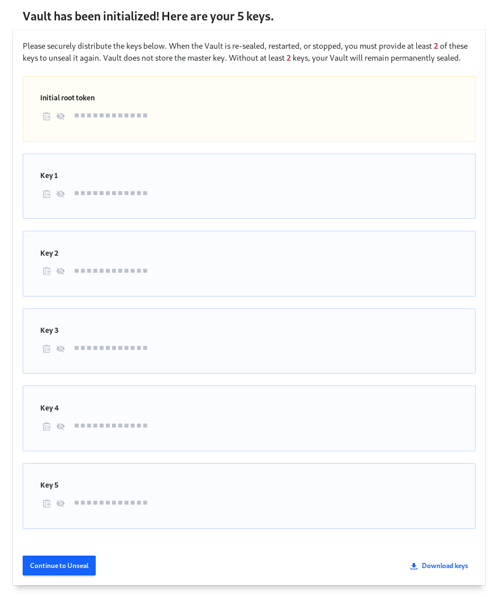
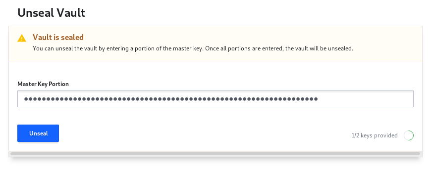
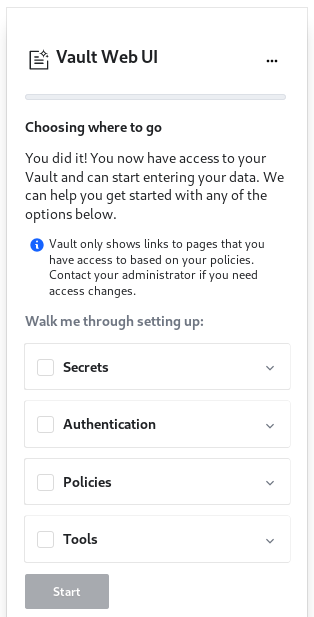

Vault Setup
===========

This process covers how to set up a fresh HashiCorp Vault server after it has
been deployed. It uses both the UI and the command-line client to get a feel
for each of them, however nearly all operations can be performed through both
interfaces. When in doubt, the command-line client will probably have the
required features. However, the UI also has a builtin command-line client that
you can use.

Steps
-----

### Key Creation and Unsealing

After Vault has been deployed and started, unseal keys need to be created.
These keys will be used to encrypt the secrets at rest in the storage backend.
When the Vault server starts, it will be in a "sealed" state - it will not have
access to these encrypted secrets, because it does not have the decryption key.
The server can then be "unsealed" by providing it the necessary key material to
assemble the decryption key and access the encrypted secrets. After the server
is unsealed, it can be used normally. Read more about sealing and unsealing in
[the HashiCorp documentation](https://www.vaultproject.io/docs/concepts/seal.html).

First, navigate to the Vault host in your browser. You will be greeted by a
form asking you to set up the unseal keys.


We will create 5 keys, 2 of which will be required to unseal. That way no one
person can perform the unseal operation, but it won't be too difficult to
recover in an emergency.

Once the unseal keys are generated, we can view the keys for distribution. An
initial root token is also created. This root token provides full access to
everything in the Vault server, and is analogous to an AWS root account.



Click "Download keys" in the bottom-right corner to download the keys and the
root token. This will download a JSON file that contains the keys in hex and
base64 formats, as well as the root token in the following format:

```json
{
  "keys": [
    "REDACTED",
    "REDACTED",
    "REDACTED",
    "REDACTED",
    "REDACTED",
  ],
  "keys_base64": [
    "REDACTED",
    "REDACTED",
    "REDACTED",
    "REDACTED",
    "REDACTED",
  ],
  "root_token": "REDACTED"
}
```

These keys should be distributed to multiple people and stored safely. If four
of the keys are lost, the secrets will become inaccessible!

Once the keys are downloaded, we can proceed to the unsealing operation. Enter
one of the keys in the unseal form to start the process.


Once the first key is entered, the form will show that we have provided 1/2
keys. We now need to enter another one of the keys into the form.



Success! Vault is unsealed. Now we can sign in to perform initial setup using
the root token.

### Signing in with the Root Token

First we'll cover signing in through the HTTP UI, since it provides an
integrated command-line client. However, the rest of this guide will use the
command-line client.


Select "Token" as the method, and paste the root token in. Right now,
token-based authentication is the only enabled auth method. We will enable a
new method later.

Once signed in, a guide will be displayed to walk you through setting up some
of the components of Vault.



If you want to play around with this, feel free to set up [a dev server](https://www.vaultproject.io/docs/concepts/dev-server.html)
locally to play around. However, we will disable it.


The UI provides a helpful command-line client for those who do not want to
install Vault locally on their machine.


Click on the terminal-looking icon next to the status display in the top
right-hand corner of the UI to access it.

The rest of this guide will use the command-line client, and it is recommended
you [install Vault](https://www.vaultproject.io/docs/install/index.html) on
your laptop to use that client.

Once installed, we must export a few variables to configure the Vault client to
talk to the correct server.

```shell
$ export VAULT_ADDR="https://vault.ritsec.cloud:8200"
$ export VAULT_SKIP_VERIFY=1  # Disables TLS certificate validation
```

We are exporting `VAULT_SKIP_VERIFY` because at time of writing, the Vault TLS
certificate is signed by the LetsEncrypt testing environment.

Next, log in to the Vault server with the root token.

```shell
$ vault login REDACTED
Success! You are now authenticated. The token information displayed below
is already stored in the token helper. You do NOT need to run "vault login"
again. Future Vault requests will automatically use this token.

Key                  Value
---                  -----
token                REDACTED
token_accessor       REDACTED
token_duration       ∞
token_renewable      false
token_policies       ["root"]
identity_policies    []
policies             ["root"]
```

You are now authenticated as root!

### Setting up and Using Secrets

For most basic secrets like passwords, the key-value secrets engine works
pretty well. With this secrets engine, multiple key-value pairs can be stored
under a single path. We can use this to store username/password pairs for hosts
and services for the Operations Program.

We'll add the key-value secrets engine to the `ops/` path.

```shell
$ vault secrets enable -path=ops -version=2 kv
Success! Enabled the kv secrets engine at: ops/
```

Let's add an example secret. It'll be our username and password for a cool chat
server we found. Note that passwords with special characters may not behave
well on the command-line, so updating them through the web UI may be preferred.

```shell
$ vault kv put ops/freenode AzureDiamond=hunter2
Key              Value
---              -----
created_time     2019-10-14T23:15:16.965452048Z
deletion_time    n/a
destroyed        false
version          1
```

Now we can access that password later on to log in.

```shell
$ vault kv get ops/freenode
====== Metadata ======
Key              Value
---              -----
created_time     2019-10-14T23:15:16.965452048Z
deletion_time    n/a
destroyed        false
version          1

======== Data ========
Key             Value
---             -----
AzureDiamond    hunter2
```

Note that all keys and values under the path are printed. Access control cannot
be applied at a per-key level, only at a per-path level.

Unfortunately, somehow it appears that our password got leaked. We changed it
on the server, and now we need to update its value in Vault.

```shell
$ vault kv put ops/freenode AzureDiamond=hunter3
Key              Value
---              -----
created_time     2019-10-14T23:19:09.361652941Z
deletion_time    n/a
destroyed        false
version          2
```

Note that the `version` is now 2. The key-value secrets engine is a versioned
secret storage. This way, a history of all the values for a key can be kept.
Performing a `get` operation will automatically get the latest version, however
a previous version can be specified if desired.

We deleted our chat server account after getting flamed, so we'll delete the
password now.

```shell
$ vault kv metadata delete ops/freenode
Success! Data deleted (if it existed) at: ops/metadata/freenode
```

This will delete all versions of all key-value pairs under `ops/freenode`,
including their metadata. The `vault kv delete` command can be used to delete
individual versions from a path.

### Adding Users and Policies

Now that a secrets engine has been created, we should create a policy to allow
access to that engine. Policies allow detailed access control to secrets and
settings within Vault.

We'll set up a policy to allow admin access to everything in Vault, essentially
giving the same access as the root token. This is so we can have proper access
logging on who does what on Vault.

Write the following policy to a file named `admin.hcl`:
```
path "*" {
  capabilities = ["sudo", "create", "read", "update", "delete", "list"]
}
```

Now we can add the policy to Vault.

```shell
$ vault policy fmt admin.hcl
Success! Formatted policy: admin.hcl
$ vault policy write admin admin.hcl
Success! Uploaded policy: admin
```

Policies don't do us any good unless we have users to apply them to, so we'll
add a new authentication method to allow users to log in with a username and
password.

```shell
$ vault auth enable userpass
Success! Enabled userpass auth method at: userpass/
```

Now we can create a new user for ourselves to use Vault with.

```shell
$ vault write auth/userpass/users/newman password=REDACTED policies=admin
Success! Data written to: auth/userpass/users/newman
```

We'll re-login with our new user now.

```shell
$ vault login -method=userpass username=newman
Password (will be hidden): 
Success! You are now authenticated. The token information displayed below
is already stored in the token helper. You do NOT need to run "vault login"
again. Future Vault requests will automatically use this token.

Key                    Value
---                    -----
token                  REDACTED
token_accessor         REDACTED
token_duration         768h
token_renewable        true
token_policies         ["admin" "default"]
identity_policies      []
policies               ["admin" "default"]
token_meta_username    newman
```

Finally, we will revoke the root token since we have no more use for it. Always
good to clean up after yourself!

```shell
$ vault token revoke REDACTED
Success! Revoked token (if it existed)
```